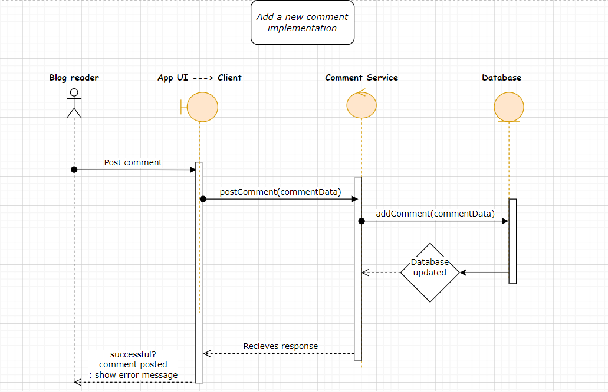
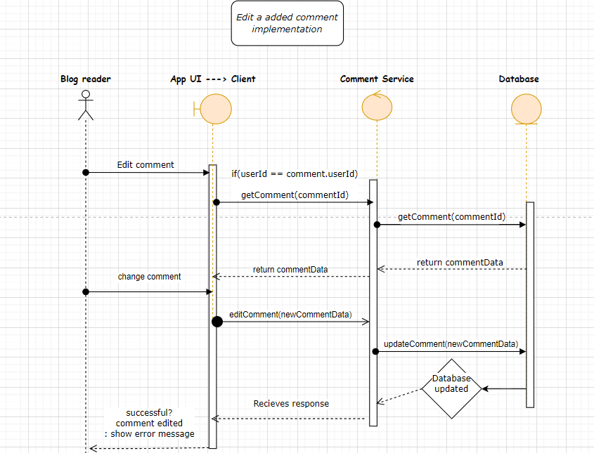
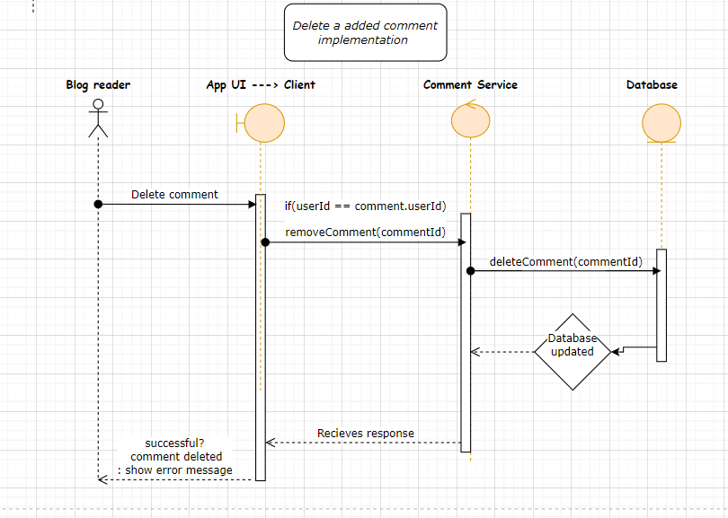
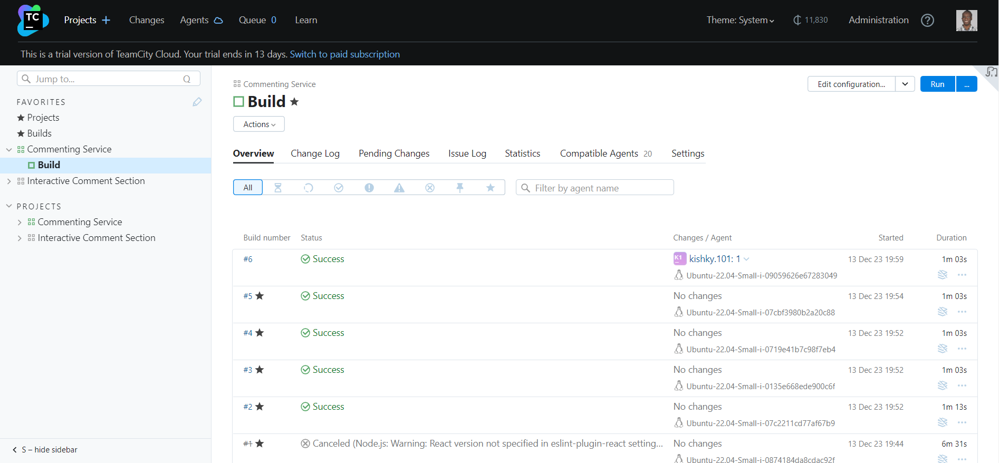

# Introduction

Welcome to the <span style="color:green">Comment Web App!</span> This web application allows users to engage in dynamic discussions by creating, editing, deleting, liking comments, and even replying to each other. The app is built using modern web technologies, including Vite, Typescript, SCSS, React, and Redux Toolkit.

## Scope

- **Adding New Comments:** Users can express their thoughts by creating new comments effortlessly.
- **Edit Comment:** Users can edit comments to refine or update ideas.
- **Delete Comment:** Users can remove comments that are no longer relevant or needed.
- **Like Comment:** Users can show appreciation for interesting or insightful comments.
- **Reply to Comments:** Users can engage in conversations by replying to existing comments.
- **In-Memory Database:** The app utilizes an in-memory database, ensuring that all changes are temporary and reset after a page refresh.
- **Responsive Design:** The interface is designed to provide a seamless experience across a variety of devices, ensuring accessibility for users on desktops, tablets, and smartphones.
- **Continuous Integration (CI):** is a software development practice that automates the integration of code changes from various contributors into a shared repository. 

## Used software architecture

>Microservice architecture[^1] is the most suitable architectural choice for a blogging platform due to its inherent flexibility, scalability, and maintainability. By decomposing the system into small, independent services, microservices allow for individual development, deployment, and scaling of components. This modular approach enhances agility, enabling seamless updates and additions to specific functionalities like user management, content creation, and comments. Additionally, microservices support efficient resource allocation, ensuring optimal performance as the platform grows, and simplifying maintenance by isolating potential issues to specific services.

## Software design and model
- ***Adding New Comments***
    
    A UML sequence diagram demonstrating the interactions between the application for a user to post a new comment.

- ***Edit Comments***
    
    A UML sequence diagram demonstrating the interactions between the application for a user to edit a comment after it has been posted.

- ***Delete Comments***
    
    A UML sequence diagram demonstrating the interactions between the application for a user to delete a comment after it has been posted. 

- ***Build Pipeline***
    
    A screenshot from Team city dashboard displaying the successfully configured build pipeline.


## Test cases
- [ ] Users can add new comments
- [ ] Users can edit comments
- [ ] Users can delete comments

## Technologies Used

- **Vite:** Fast, opinionated web development build tool that sets up a new project with a single command. [vite documentation](https://vitejs.dev/guide/).
- **Typescript:** Adds static typing to JavaScript, enhancing code reliability and developer productivity. [Typescript documentation](https://www.typescriptlang.org/docs/).
- **SCSS:** A preprocessor scripting language that is interpreted or compiled into CSS, providing a more maintainable and structured stylesheet. [SASS documentation](https://sass-lang.com/documentation/).
- **React:** A JavaScript library for building user interfaces, offering a declarative and efficient way to create interactive UIs. [React documentation](https://react.dev/learn).
- **Redux Toolkit:** An opinionated, batteries-included toolset for efficient Redux development, simplifying the state management process. [Redux toolkit documentation](https://redux-toolkit.js.org/introduction/getting-started).
- **Team city:** TeamCity is a general-purpose CI/CD software platform that allows for flexible workflows, collaboration and development practices. [Team city CI/CD documentation](https://www.jetbrains.com/teamcity/ci-cd-guide/)

## Getting Started

1. **Clone the Repository:**
   ```bash
   git clone https://github.com/kishky101/commenting_service.git
   cd commenting_service


2. **Install Dependencies**
    ```bash
    npm install

3. **Run the Development Server**
    ```bash
    npm run dev

4. **Open in Browser**
    Visit ```http://localhost:3000``` in your preferred web browser to explore the Comment Web App.

> [!NOTE]
> This project was built for introduction to software engineering course in the university.

[^1]: you can read more about microservice architecture [here](https://en.wikipedia.org/wiki/Microservices)